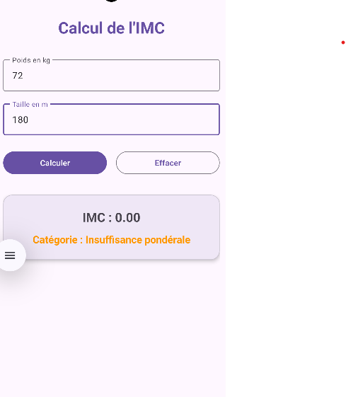
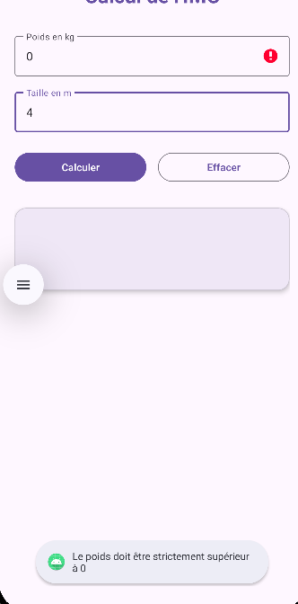

# Application Calcul de l'IMC (Indice de Masse Corporelle)

Application Android développée en **Kotlin** dans le cadre du TP Android Studio. L'application permet de calculer l'Indice de Masse Corporelle (IMC) à partir du poids (en kg) et de la taille (en m), puis d'en afficher l'interprétation associée ainsi qu'une couleur indicative.

---

##  Fonctionnalités

-  **Saisie des données** : Saisie du poids (kg) et de la taille (m) avec un clavier numérique décimal.
-  **Calcul automatique de l'IMC** : Formule $\text{IMC} = \frac{\text{poids}}{\text{taille}^2}$, arrondi à 2 chiffres après la virgule.
-  **Interprétation & Couleurs** :
  - `< 18,5` : Insuffisance pondérale (Orange)
  - `18,5 à < 25,0` : Corpulence normale (Vert)
  - `25,0 à < 30,0` : Surpoids (Orange)
  - `30,0 à < 35,0` : Obésité modérée (Rouge)
  - `35,0 à < 40,0` : Obésité sévère (Rouge)
  - `≥ 40,0` : Obésité morbide (Rouge foncé)
-  **Validation des saisies & Gestion des erreurs** :
  - Détection des champs vides avec affichage d'un message d'erreur et d'un `Toast`.
  - Contrôle des valeurs strictement positives ($> 0$).
  - Support de la virgule `,` et du point `.` comme séparateur décimal.
- 🧹 **Bouton Effacer** : Vide les champs, efface les résultats/erreurs et replace le curseur sur le champ poids.

---

## 🛠️ Technologies & Configuration

- **Langage** : Kotlin
- **Interface** : Material Design 3, ConstraintLayout, ScrollView
- **SDK Minimum** : API 28 (Android 9.0)
- **SDK Cible** : API 37

---

## 📁 Structure des Fichiers Clés

- [`MainActivity.kt`](app/src/main/java/com/example/calculimc/MainActivity.kt) : Code Kotlin contenant la logique du calcul, la validation et l'affichage.
- [`activity_main.xml`](app/src/main/res/layout/activity_main.xml) : Interface utilisateur avec tous les identifiants requis (`editTextPoids`, `editTextTaille`, `buttonCalculer`, `buttonEffacer`, `textViewImc`, `textViewCategorie`).
- [`strings.xml`](app/src/main/res/values/strings.xml) : Toutes les chaînes de texte de l'application.
- [`colors.xml`](app/src/main/res/values/colors.xml) : Couleurs des différentes catégories d'IMC.

---

## 🧪 Cas de tests effectués

| Données saisies | Résultat attendu | Message / Catégorie attendue | Couleur |
| :--- | :--- | :--- | :--- |
| **70 kg et 1,75 m** | 22.86 | Corpulence normale | Vert |
| **50 kg et 1,75 m** | 16.33 | Insuffisance pondérale | Orange |
| **85 kg et 1,70 m** | 29.41 | Surpoids | Orange |
| **100 kg et 1,70 m** | 34.60 | Obésité modérée | Rouge |
| **Champ vide** | Aucun calcul | Message d'erreur | - |
| **Taille = 0** | Aucun calcul | Message d'erreur | - |

---

## 📸 Captures d'écran

| Calcul valide | Erreur de saisie |
| :---: | :---: |
|  |  |

---

## 🚀 Installation & Exécution

1. Cloner le dépôt :
   ```bash
   git clone https://github.com/azizbeji-wq/Calcul_imc.git
   ```
2. Ouvrir le projet dans **Android Studio**.
3. Synchroniser Gradle et lancer l'application sur un émulateur ou appareil physique.
